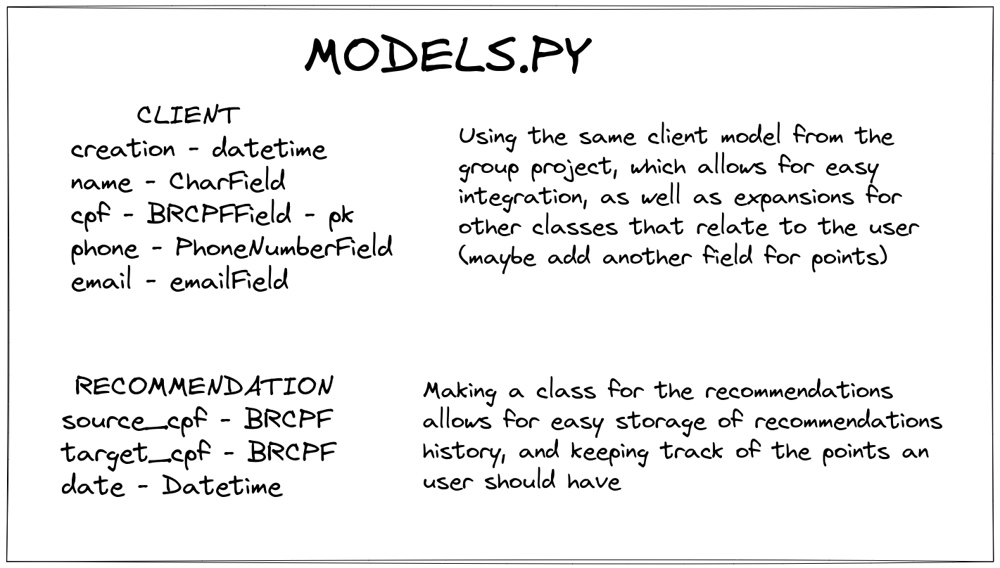
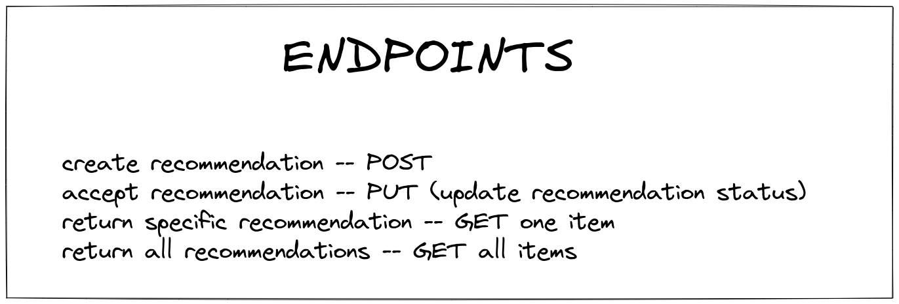
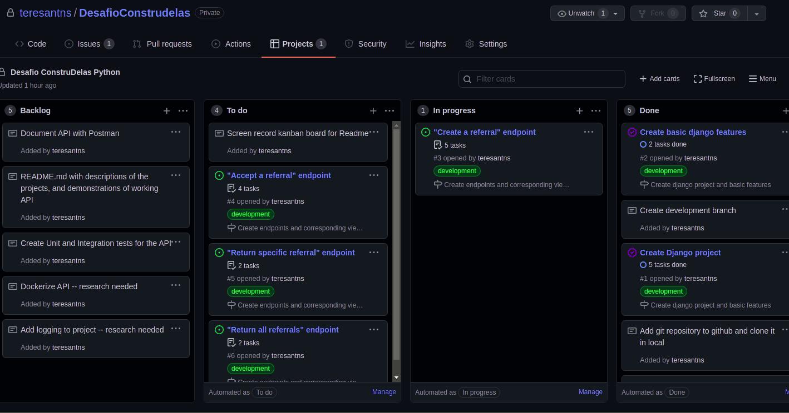
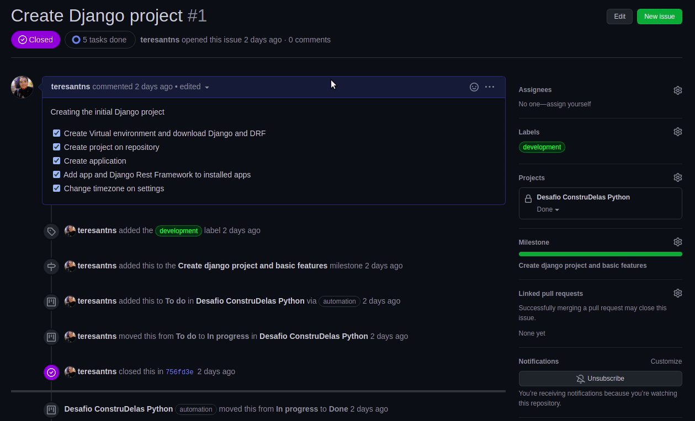
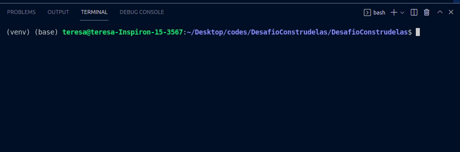

<div id="top"></div>

# Desafio Final Construdelas

This is the final individual project of [Gama Academy](https://www.gama.academy/)'s  Construdelas Python training in partnership with [Juntos Somos +](https://www.juntossomosmais.com.br/), created by participant [Teresa Seabra Antunes](https://github.com/teresantns).

The goal of this project was to develop an API and create endpoints related to a `Loyalty Program` system. We were challenged to create four basic endpoints functionalities: for creating a referral; accepting a referral; getting information on a specific referral; and getting information on all registered referrals. 

The API was developed with [Django](https://www.djangoproject.com/) and [Django REST framework](https://www.django-rest-framework.org/)

## Table of Contents

<details>
<summary>Click to expand!</summary>
  
- [Running the project](#run)
  - [API endpoints](#endpoints)
- [How the project was carried out](#carry)
  - [Planning](#plan)
  - [Git branching](#git)
  - [Documentation](#doc)
  - [Testing](#test)
  - [Logging](#log)
  - [Docker](#docker)
- [Some considerations](#considerations)
  - [A 'bug' to take into consideration](#bug)
  - [What's next?](#next)
  
</details>


--- 

# 🚀&nbsp; Running the project <a name="run"></a>
This project uses [docker](https://www.docker.com/) and [docker-compose](https://docs.docker.com/compose/). First, clone the repository to create a local copy of the directories:

```shell
git clone https://github.com/teresantns/DesafioConstrudelas
```

### Running the API <a name="run1"></a>
Run `docker-compose up --build app` (wait for the docker container to build) and the API will be available on port 8000 (http://localhost:8000) 

### Running the tests <a name="run2"></a>
Simply run `docker-compose up --build tests` to run the tests, and they will run on terminal!
<p align="right">(<a href="#top">back to top</a>)</p>

## 📌 API endpoints: <a name="endpoints"></a>
- **POST** - `/user/` - Creates a new user.
- **GET** - `/user/<str:cpf>/` - Gets information of the user with the CPF specified on the url.
- **PUT** - `/user/<str:cpf>/` - Updates information of the user with the CPF specified on the url.
- **GET** - `/all-referrals/` - 
Gets the data of all referrals on database.
- **GET** - `/all-referrals/<str:cpf>/` - Gets the data of all referrals on database made by specific user, whose CPF is passed on the URL path.
- **GET** - `/referral/<str:cpf>/` -Gets the data of a specific referral on database given the CPF of the referred person, which is passed on the URL path.
- **POST** - `/create-referral/` - Creates a Referral, following the rules set by the challenge.
- **GET** - `/accept-referral/<str:cpf>/` - Gets a specific referral, allowing its acceptance. The referred person's CPF is passed on the URL path.
- **PUT** - `/accept-referral/<str:cpf>/` - Updates referral, allowing its acceptance ('true' on status field). The CPF of referred person is passed on the URL path.

For a more detailed documentation of each route, with examples of requests and returns, check out the [Postman documentation](https://documenter.getpostman.com/view/18867856/UVREij7v), and to see an example of how the project works, check out [this video](https://youtu.be/c-1VzqgEX5s)!

<p align="right">(<a href="#top">back to top</a>)</p>


--- 

# How the project was carried out <a name="carry"></a>

Well, this is pretty much everything you need to run the project and to see my work in action, but I wanted to explain a bit further how I organized for the challenge, and all the `extras` that I worked on. If you're interested in that (or is evaluating me, keep on reading!

## 📆 Planning <a name="plan"></a>

### Modeling the challenge with Excalidraw
Before the actual code development, the project was modelled using the drawing tool [Excalidraw](https://excalidraw.com/), which is a whiteboard tool that allows us to create mind maps and organize our ideas. 

Following from the [first group project](https://github.com/thaisbighetti/django-livre) we developed for the academy, I organized which fields I wanted for each model of the project, specifying how they would be built on Django. I mainly considered this project as an addition of the previous one, modelling in a way they would be easily integrated and the loyalty and banking functions could exist in the same environment. So, this is how the modeling was initially done:

Modeling of models.py file | Modeling of endpoints
:-------------------------:|:-------------------------:
  |  

As we the project was being developed, some changes were made to this initial plan, for example, the field `status` was added to the `referral` class, to indicate whether the indication was still pending (`False`) or accepted (`True`). Nevertheless, these diagrams are very helpful to visualize the project as a whole, and can be even used to explain the details of the models without the code.

<p align="right">(<a href="#top">back to top</a>)</p>

### Kanban board and github project
> Kanban is a popular framework used to implement agile and DevOps software development. It requires real-time communication of capacity and full transparency of work. Work items are represented visually on a kanban board, allowing team members to see the state of every piece of work at any time.
> -- https://www.atlassian.com/agile/kanban

This project was organized with a `kanban board` template, available for use in Github's [project board feature](https://docs.github.com/en/issues/organizing-your-work-with-project-boards/managing-project-boards/about-project-boards). **You can check the board [here](https://github.com/teresantns/DesafioConstrudelas/projects/1)**. We have the main columns - To do, In progress and Done - which were used throughout the project to organize the tasks. In the `backlog` column, we have some ideas which weren't fully implemented, and can be used for reference for further developing the project (as explained in the [What's next](#next) session).

As the project is finished for evaluation, all tasks are in the `Done` column, but in the following gif we have an example of how the board looked during the development stage:


*Kanban board during the project development*

Github's project feature was chosen over other Kanban tools (such as Trello) because of the easy integration with other aspects of the project that concern `git versioning`. We can create [issues](https://github.com/teresantns/DesafioConstrudelas/issues?q=is%3Aissue+is%3Aclosed) and organize them in [milestones](https://github.com/teresantns/DesafioConstrudelas/milestones?state=closed) that are automated in the board's columns. Theses issues can be referenced on `commits`, and the information and code are easily organized. Since the project was done in smaller commits, this is rather useful for visualizing better the timeline of events, and how they were made. 


*Example of issue*

As illustrated in the previous image, when viewing an issue, we have direct access to the commits that link it, we can tag it to better organize the project board, and include it in a specific milestone. This method is also useful for working with contributors, since they can create an issue, which can be also linked to specific pull requests. We can also assign the issue to someone. 

Throughout the project, the issues were used to separate the features that needed to be worked on, and organize the kanban board. There are some issues (like [this one](https://togithub.com/teresantns/DesafioConstrudelas/issues/13)) that are more simple, with just a checklist or a brief description of the feature being worked, and others (such as [this one](https://togithub.com/teresantns/DesafioConstrudelas/issues/10)) that are more detailed, with pictures and comments. Also, they have varying degrees of commits associated with them, since some of them are referring to tasks that are mainly done not in the code (like the [issue](https://togithub.com/teresantns/DesafioConstrudelas/issues/14) organizing this README.md).

<p align="right">(<a href="#top">back to top</a>)</p>

## 🌿 Git branching <a name="git"></a>
Even though this project was done by just one person, I tried to organize different aspects into different `git branches` and tried to commit regularly (hence the high number of commits for such a simple project, sorry). This is mainly to "mimick" the way development is usually carried out in teams, where multiple people work in a repository at the same time, and branching the work is a good practice to isolate features during production. 

I started by branching into `development`, to work on the features of the django project such as the views page and the serializers. Then, some branches were created for different stages of the project: `documentation`, `testing`, `logging` and `docker`, when these features were being built. The changes were merged into the `main` branch only when they were sufficiently ready and at a 'final stage'.

By using the [Gitg](https://wiki.gnome.org/Apps/Gitg/) GNOME app, (or using the VScode [git graph](https://github.com/mhutchie/vscode-git-graph) extension) we can see the final `branch tree` of the project, with the commits:


<p align="right">(<a href="#top">back to top</a>)</p>

## ℹ️ Documentation <a name="doc"></a>

Documenting your code is a fundamental practice, that helps make information more easily accessible, not only for you, but also for anyone who may need to use what you developed. In the context of an API, the main part of this project, this translates to the need of documenting the endpoints, explaining their functionality, usage, and how they integrate with the application overall. 

All the classes and methods of the project have their own `docstring documentation` with a brief description of how they work, as exemplified by [this view](loyalty_program/apps/referral/views.py#L68-L95). In each of them, it is described what the function expects (for example, a JSON and POST as a http method) and what is the API response (e.g., the http status and the JSON response).


[Postman](https://www.postman.com/) is an application usually used for API testing and documentation. For a more detailed documentation than the one provided on the docstrings, Postman was used to create examples of different requests on our API endpoints, and what they return. The docstrings on the code give examples of only successful requests, but with Postman **we can also document the responses when the user tries to make bad requests.** As mentioned in the listing of endpoints, you can check out the full documentation [published here](https://documenter.getpostman.com/view/18867856/UVREij7v).

[This milestone](https://github.com/teresantns/DesafioConstrudelas/milestone/4?closed=1) gathers all issues and commits related to the implementation of the project documentation, via Postman and docstrings.

<p align="right">(<a href="#top">back to top</a>)</p>

## ✔️ Testing <a name="test"></a>
**Writing tests is essential to guarantee the efficiency and consistency of our code** in an automatized manner. Even though our code might be performing well at first glance, we might be missing some key bugs and defects by not implementing some basic tests to check our work.

Testing can be done to check individual units of code (unit testing) or to check the relation between our modules (integration testing). I used django's [`TestCase` class](https://docs.djangoproject.com/en/3.1/topics/testing/tools/#django.test.TestCase), and Django REST framework [`APIClient` class](https://www.django-rest-framework.org/api-guide/testing/#apiclient) to create tests for our models and API endpoints.

[This issue](https://github.com/teresantns/DesafioConstrudelas/issues/13) gathers all the commits relating to the implementation of tests. [Here](loyalty_program/apps/referral/tests/) we can find the test folder, with all the [unit tests](loyalty_program/apps/referral/tests/test_unit.py), [integration tests](loyalty_program/apps/referral/tests/integration/), and useful functions and utilities to perform the testing.

If you're running the project like a usual django project in your machine, run `python manage.py test loyalty_program.apps.referral.tests` on the terminal to run the tests. If you're using docker, run `docker-compose up --build tests` to build the container with the tests. You should see 37 tests ran with no issues raised.


*Running the tests in the terminal*

<p align="right">(<a href="#top">back to top</a>)</p>


## 🔎 Logging <a name="log"></a>
Logging is a useful practice in programming to debug your code that allows us to get a detailed view of how our application is running, and what steps are being taken. Writing logs that can help us to find problems, during and after development, to prevent future bugs, and to easily find the source of problems after our API is running.

A simple logging system was implemented by using the Python [logging module](https://docs.python.org/3/library/logging.html). [This milestone](https://github.com/teresantns/DesafioConstrudelas/milestone/6?closed=1) gathers all issues and commits relating to the logging implementation. 

Currently the logging is being stored in two files: [one](loyalty_program/log_files/info_logs.log) for recording all `info` and above level messages from the entirety of the code, and [another one](loyalty_program/log_files/requests_logs.log) that records `warning` levels in the API requests. These loggers can be easily changed, or others may be added, in the [settings.py](loyalty_program/settings.py#L134-L181) file, which configures all loggers for the Django project.

It is not common to leave these log files into the project, as they are usually included in the `.gitignore` file. To change this, simply remove the comments on [these lines](.gitignore#L58-L60) to untrack these files. The (many) logs on the files were stored after the project was done, when I was testing implementing docker to the project, and adding more clients and referrals to the database, and they give us a good idea of the type of logging messages that were put in place.

<p align="right">(<a href="#top">back to top</a>)</p>

## 📦 Docker <a name="docker"></a>
[Docker](https://docs.docker.com/) is an open source software platform to create, deploy and manage virtualized application containers on a common operating system (OS), with an ecosystem of allied tool. It allows developers to share applications that can work independent of the machine their are operating on, by creating containers that can be shared and easily replicated. [Docker compose](https://docs.docker.com/compose/) is a tool for running multi-container applications on Docker.

Using Gigek's [django-drf-playground](https://togithub.com/lgigek/django-drf-playground) as a guide, as well as video tutorials and documentation, I implemented docker-compose to easily containerise the project, and simplify the running of the API and tests. By doing so, it is easier for people to run and check out my work in their own machines, and I can rest assured that it will work.

[This milestone](https://github.com/teresantns/DesafioConstrudelas/milestone/5?closed=1) has the issues and commits relating to the docker implementation. Note that, even though the project is relatively simple, I opted for using the docker-compose method, as opposed to simply running a basic docker file, to practice docker a bit more and to isolate my tests so that they can be easily ran by everyone. I figured, since I had two commands I regularly ran with `manage.py`, for running the server and performing the tests, it would be better to allow the contributors to do the same. Also, if further updates on the project require so, other containers can be easily configured.

<p align="right">(<a href="#top">back to top</a>)</p>


--- 

# Some considerations <a name="considerations"></a>

## 🐛 A 'bug' to take into consideration <a name="bug"></a>
A little 'bug' was found while developing the project, and, with some research, I found that it was a problem inherent to using a `BooleanField` with the checkboxes that render automatically in Django REST Framework. 

As explained in [this issue](https://github.com/teresantns/DesafioConstrudelas/issues/10), trying to update a referral with a blank checkbox on the `accept-referral` endpoint raises a **`MultiValueDictKeyError`**. This would be a problem if an user tried to 'reject' their referral. After some research, I found that this behaviour is due to the way boolean fields work in HTML, as mentioned by the [comments](https://togithub.com/encode/django-rest-framework/issues/3811)  on a discussion revolving the same issue. This is easily avoided by using the Raw data JSON input method, instead of the HTML form.

Even though this is not a "fixable" bug, and it doesn't impair the API from working properly, I found it interesting to note, since it could probably become a problem for the front end team in the future. 


<p align="right">(<a href="#top">back to top</a>)</p>

## ➡️ What's next? <a name="next"></a>
As mentioned before, this project has many room to expand and be enhanced. Some of my ideas for future developments are briefly mentioned in the [project board](https://github.com/teresantns/DesafioConstrudelas/projects/1) backlog, but here are some TODOs for the future:

### Changing the database
Currently the project is using Django's default database system, [SQLite](https://www.sqlite.org/index.html). Other open-source relational database management systems, such as [MySQL](https://www.mysql.com/) and [PostgreSQL](https://www.postgresql.org/) are more commonly used by teams, specially when working with larger volumes of data, or dealing with websites and web applications. The project database is easily changed by correctly configuring the database settings in the `setting.py` django file, and the migration (which I researched for PostgreSQL) is pretty straightforward. The change wasn't done for the final version for time reasons.

### Automated referral deletion
Currently, the way we are dealing with expired referrals (older than 30 days) is by deleting them from the database with [this function](https://togithub.com/teresantns/DesafioConstrudelas/issues/8). If we wish to keep these referral instances for a data analysis purpose, we could change the logic to include a choice field instead of the boolean status field. We could have three choices: Accepted, Pending and Expired. This way, when the referral expires, it is not removed from the database. This would require some changes into the creating referral logic, to prevent that expired referrals can be accepted, and the `target_cpf` field would have to be non unique, since a user could have multiple referrals towards them (if the existing ones are expired).

To automate the currently method, the function could be turned into a reocurring task with [crontab](https://www.adminschoice.com/crontab-quick-reference) or [celery](https://docs.celeryproject.org/en/stable/), since it is independent of the rest of the code. This would require that the function is not called on the `views.py` file, but automated to be called periodically.

### Endpoint pagination
The responses on the API endpoints can be edited to follow a specific pagination guideline, for a more uniform look. This can be done on Django REST framework, whose views allow for implementing a [pagination style](https://www.django-rest-framework.org/api-guide/pagination/). This was also left behind for time constraints reasons, because it would entail re-doing all of the tests that were already built for the responses I had at the time.

### Creating an account when referral is accepted
Finally, a logic to create an account automatically when a user accepts an invitation can be implemented. Thinking of an integration with the front-end team and a more complex project, the user can be redirected to a page to create an account (which would update this 'dummy' account) when they accept the referral. The person who made the referral can also be notified by email of the points they received.


<p align="right">(<a href="#top">back to top</a>)</p>

### 💜 Thank you if you've read this far!
